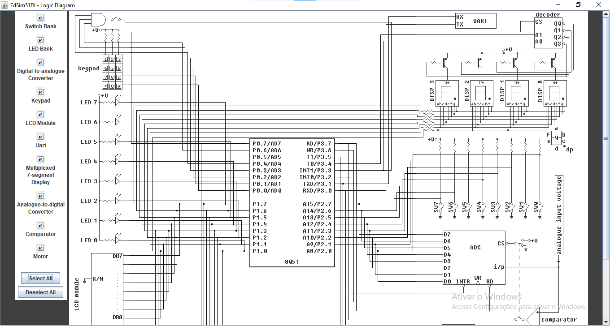

# Projeto 1 - SEL0614 - Aplicação de Microprocessadores

## Cronômetro digital

### Autor:
João Victor Breches Alves - 13677142

### Introdução:
Esse é o primeiro projeto do curso de Aplicação de Microprocessadores (SEL0614) no qual foi feito um cronômetro digital em assembly e
8051, devidamente comentado.

O código principal está no arquivo "ProjCode.asm".

### Execução:
O código deve ser executado no simulador de 8051 ['EdSim51'](https://edsim51.com/), o mesmo simulador usado em aulas. O esquemático
utilizado é o do mesmo simulador, já conhecido nas aulas.

### Funcionamento:
Este código implementa um cronômetro digital que realiza a contagem de 0 a 9 em um display de 7 segmentos. O principal objetivo é permitir que essa contagem ocorra com dois intervalos de tempo distintos: 0,25 segundos e 1 segundo, alternando conforme o pressionamento de dois botões (SW0 e SW1). Quando o programa inicia, ele não começa a contagem imediatamente, mas aguarda que um desses botões seja pressionado. Enquanto isso, o display de 7 segmentos permanece desligado.

Ao pressionar o botão SW0, o cronômetro inicia a contagem com um intervalo de 0,25 segundos entre os números. Se o botão SW1 for pressionado, o intervalo muda para 1 segundo entre os números exibidos no display. A contagem é cíclica, indo de 0 até 9, e ao atingir 9, reinicia automaticamente de volta para 0. O programa foi escrito de forma que, a cada interação com os botões, ele verifica qual deles está ativo e ajusta o intervalo de tempo de acordo com a necessidade. Se o botão SW0 for pressionado novamente, o intervalo retorna para 0,25 segundos, e se o botão SW1 for acionado, o intervalo muda para 1 segundo. Essa alternância é mantida em loop contínuo durante a execução do código.

Para realizar o controle do tempo, o código usa duas sub-rotinas de delay: uma que gera um atraso de 0,25 segundos e outra de 1 segundo. Quando o botão correspondente é pressionado, a função de delay apropriada é chamada antes de avançar a contagem e atualizar o display de 7 segmentos. A cada iteração da contagem, o número a ser exibido é enviado para o display através de uma sub-rotina específica, que mapeia os números de 0 a 9 para os respectivos padrões binários que controlam os segmentos individuais do display. Essa sub-rotina é acionada sempre que o valor do contador (armazenado no registrador R0) é incrementado, e ela garante que o número correto seja exibido no formato adequado para um display de 7 segmentos.

Além disso, o código inclui uma lógica para diferenciar o comportamento quando o botão SW1 é pressionado. Como o intervalo de 1 segundo requer que a contagem seja menos frequente, uma lógica adicional é implementada para garantir que o incremento no contador ocorra a cada 4 ciclos de 0,25 segundos, resultando efetivamente em uma atualização de 1 segundo no display. Isso é feito utilizando o registrador R1, que decrementa a cada ciclo e só permite o incremento de R0 (a contagem) quando atinge o valor zero, momento em que é recarregado para repetir o ciclo.

Esse controle baseado em delay e verificações constantes dos botões permite que o cronômetro funcione corretamente sem o uso de interrupções, utilizando apenas sub-rotinas para os atrasos de tempo e monitoramento contínuo das entradas dos botões. Ao final de cada ciclo de contagem, o programa verifica novamente o estado dos botões para ajustar o tempo de atraso conforme necessário, garantindo a alternância fluida entre os dois modos de contagem definidos.
